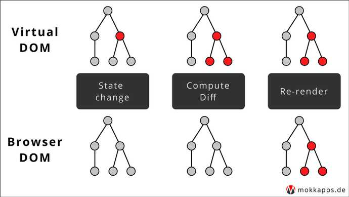

## REACT(리액트)

### React 이해

- MVC, MVW 등의 구조를 가지는 프레임워크와 달리 **오직 V(View)만** 신경쓰는 라이브러리
- 컴포넌트(component)는 재사용이 가능한 API로 수많은 기능들을 내장하며, 컴포넌트 하나에서 해당 컴포넌트의 생김새와 작동 방식을 정의
- 어떤 데이터가 변할 때 마다 어떤 변화를 줄지 고민 X → 기존 뷰를 날려 버리고 처음부터 새로 렌더링
  - CPU 점유율 증가, 메모리 사용량 증가, 렌더링 끊김 현상 발생 → **Virtual DOM** 개념으로 해결

### 초기 렌더링

- `render()` 함수를 사용하여 맨 처음 어떻게 보일지를 정하는 초기 렌더링 실행
- html 형식의 문자열을 반환하지 않고, **뷰가 어떻게 생겼고 어떻게 동작하는지에 대한 정보를 지닌 객체**를 반환
- 컴포넌트 내부에는 또 다른 컴포넌트들이 들어갈 수 있으며, `render()` 함수를 실행하면 그 내부에 있는 컴포넌트들도 재귀적으로 렌더링
- 최상위 컴포넌트의 렌더링 작업이 끝나면 지니고 있는 정보들을 사용하여 HTML markup을 만들고, 이를 정한 실제 페이지의 DOM 요소 안에 주입

### 조화 과정

- 컴포넌트에서 데이터에 변화가 발생한 경우, 새로운 요소로 갈아 끼움
- 컴포넌트는 단순히 업데이트한 값을 수정하는 것이 아니라, **새로운 데이터를 가지고 render 함수를 다시 호출**
  - 이때, render 함수가 반환하는 결과를 곧바로 DOM에 반영하지 않고 이전의 컴포넌트 정보와 현재 컴포넌트 정보를 비교
  - 비교 후, 최소한의 연산으로 DOM 트리를 업데이트

### Virtual DOM

- DOM(Document Object Model): 객체로 문서 구조를 표현하는 방법
- 규모가 큰 웹 앱에서 에 직접 접근하여 변화를 주면 성능 이슈가 발생 → **DOM을 최소한으로 조작하여 작업을 처리하는 방식으로 개선**
- Virtual DOM을 사용하면 실제 DOM에 접근하여 조작하는 대신, 이를 추상화한 JS 객체를 구성하여 사용(실제 DOM의 갸벼운 사본 개념) / **업데이터 처리 간결성**을 제공

### 실제 DOM의 업데이트 과정

1. 데이터를 업데이트 하면 전체 UI를 Virtual DOM에 리렌더링
2. 이전 Virtual DOM에 있던 내용과 현재 내용을 비교
3. 바뀐 부분만 실제 DOM에 적용

(Image taken from https://mokkapps.de/blog/debug-why-react-re-renders-a-component/)

## [Contents]

### [2022.01.13](https://github.com/jhyoon9705/react-study/blob/main/docs/20220113.md)

- Props
- State
- 이벤트 핸들링
- ref: DOM에 이름달기

### [2022.01.14](https://github.com/jhyoon9705/react-study/blob/main/docs/20220114.md)

- 컴포넌트 반복
- 라이프사이클 메소드

### [2022.01.18](https://github.com/jhyoon9705/react-study/blob/main/docs/20220118.md)

- Hooks

### [2022.01.19](https://github.com/jhyoon9705/react-study/blob/main/docs/20220119.md)

- 컴포넌트 성능 최적화

### [2022.01.20](https://github.com/jhyoon9705/react-study/blob/main/docs/20220120.md)

- immer를 사용하여 더 쉽게 불변성 유지하기

### [2022.02.05](https://github.com/jhyoon9705/react-study/blob/main/docs/20220205.md)

- SPA(Single Page Application)
- 리액트 라우터
- Route 하나에 여러 개의 path 설정하기
- URL 파라미터와 쿼리
- 서브 라우트
- 리액트 라우터 부가 기능

### [2022.02.06-1](https://github.com/jhyoon9705/react-study/blob/main/docs/20220206-1.md)

- 콜백 함수
- Promise
- async/await
- axios로 API 호출해서 데이터 받아오기

### [2022.02.06-2](https://github.com/jhyoon9705/react-study/blob/main/docs/20220206-2.md)

- Context API를 사용한 전역 상태 관리 흐름
- Context API 사용법
  - 새 Context 만들기
  - Consumer
  - Provider
- 동적 Context 사용법
- Consumer 대신 useContext 사용하기

### [2022.02.07](https://github.com/jhyoon9705/react-study/blob/main/docs/20220207.md)

#### 리덕스 라이브러리

- 리덕스 키워드
  - 액션(action)
  - 액션 생성 함수(action creator)
  - 리듀서(reducer)
  - 스토어(store)
  - 디스패치(dispatch)
  - 구독(subscribe)
- 리덕스의 세 가지 규칙
  - 단일 스토어
  - 읽기 전용 상태
  - 리듀서는 순수한 함수
- Redux 예시(React 없이)
- 참고) 리액트 프로젝트에서 리덕스를 사용할 때

### [2022.02.08](https://github.com/jhyoon9705/react-study/blob/main/docs/20220208.md)

#### 리액트 애플리케이션에 리덕스 적용하기

- 스토어 만들기
- Provider 컴포넌트를 사용하여 프로젝트에 리덕스 적용하기
- Redux DevTools 설치 및 적용
- 컨테이너 컴포넌트 만들기
- 리덕스 더 편하게 사용하기(redux-actions)
- Hooks를 사용하여 컨테이너 컴포넌트 만들기
  - useSelector로 상태조회 하기
  - useDispatch로 액션 디스패치 하기
- connect vs redux hooks

### [2022.02.09](https://github.com/jhyoon9705/react-study/blob/main/docs/20220209.md)

#### 리덕스 미들웨어를 통한 비동기 작업 관리

- 미들웨어(Middleware)
  - 미들웨어 만들기
  - redux-logger 사용하기
- 비동기 작업을 처리하는 미들웨어 사용
  - redux-thunk
    - thunk란?
    - 미들웨어 적용하기
    - hunk 생성 함수 만들기
  - redux-saga

### [2022.02.10](https://github.com/jhyoon9705/react-study/blob/main/docs/20220210.md)

#### 코드 스플리팅(Code splitting)

- JS 함수 비동기 로딩
- React.lazy와 Suspense를 통한 컴포넌트 코드 스플리팅
  - state를 사용한 코드 스플리팅
  - React.lazy와 Suspense 사용하기
- Loadable Components를 통한 코드 스플리팅
- React.lazy와 Suspense vs Loadable Components

### [2022.02.11](https://github.com/jhyoon9705/react-study/blob/main/docs/20220211.md)

#### 서버 사이드 렌더링(Server-Side Rendering, SSR)

- 서버 사이드 렌더링의 이해
  - 서버 사이드 렌더링의 장점
  - 서버 사이드 렌더링의 단점
  - 서버 사이드 렌더링과 코드 스플리팅 충돌
- 서버 사이드 렌더링 구현하기
  - 엔트리 만들기
  - SSR 전용 웹팩 환경 설정 작성하기
  - 빌드 스크립트 작성하기
  - 서버 코드 작성하기
  - 정적 파일 제공하기
- 데이터 로딩
- 참고) SSR의 환경 구축을 위한 대안
  - Next.js
  - Razzle

 

##### ※ 위 내용은 리액트를 다루는 기술(길벗, 김민준 저) 도서를 참조하여 작성하였습니다.
