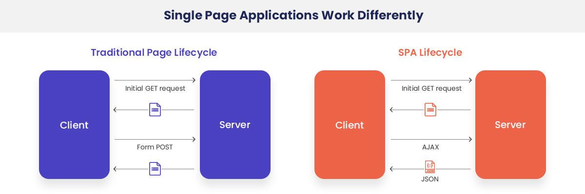

# 2022.02.05

---

- [1. SPA(Single Page Application)](#1-spasingle-page-application)
- [2. 리액트 라우터](#2-리액트-라우터)
  - [a. 라이브러리 설치](#a-라이브러리-설치)
  - [b. 프로젝트에 라우터 적용](#b-프로젝트에-라우터-적용)
  - [c. Route 컴포넌트로 특정 주소에 컴포넌트 연결](#c-route-컴포넌트로-특정-주소에-컴포넌트-연결)
  - [d. Link 컴포넌트를 사용하여 다른 주소로 이동하기](#d-link-컴포넌트를-사용하여-다른-주소로-이동하기)
- [3. Route 하나에 여러 개의 path 설정하기](#3-route-하나에-여러-개의-path-설정하기)
- [4. URL 파라미터와 쿼리](#4-url-파라미터와-쿼리)
  - [a. URL 파라미터](#a-url-파라미터)
  - [b. URL 쿼리](#b-url-쿼리)
- [5. 서브 라우트](#5-서브-라우트)
- [6. 리액트 라우터 부가 기능](#6-리액트-라우터-부가-기능)
  - [a. history](#a-history)
  - [b. withRouter](#b-withrouter)
  - [c. Switch](#c-switch)
  - [d. NavLink](#d-navlink)

---

## SPA와 리액트 라우터

### 1. SPA(Single Page Application)

: 한 개의 페이지로 이루어진 애플리케이션 <br />

- **전통적인 웹 페이지**

  - 여러 페이지로 구성되어 사용자가 다른 페이지로 이동할 때마다 새로운 html을 받아오고, 페이지를 로딩할 때마다 서버에서 리소스를 전달받아 해석한 뒤 화면에 띄움
  - 성능상의 문제 발생 가능
  - 화면 전환할 때마다 html을 계속 서버에 새로 요청할 경우 사용자 인터페이스에서 사용하고 있던 상태 유지가 번거로움
  - 바뀌지 않는 부분까지 새로 불러와야 하므로 불필요한 로딩 발생 → 비효율적
    <br/>

- **SPA**
  - View 렌더링을 사용자의 브라우저가 담당
  - 애플리케이션을 브라우저에 불러와서 실행시킨 후에 사용자와 interaction이 발생하면 필요한 부분만 JS를 이용하여 업데이트
  - 새로운 데이터가 필요한 경우 서버 API를 호출하여 필요한 데이터만 새로 불러옴
  - 서버에서 사용자에게 제공하는 페이지는 한 종류이지만, 해당 페이지에서 로딩된 JS와 현재 사용자 브라우저의 주소 상태에 따라 다양한 화면을 보여줌 → **라우팅(Routing)**



(Image taken from https://www.excellentwebworld.com/what-is-a-single-page-application/)

- **SPA의 단점**
  - 앱의 규모가 커지면 JS파일이 매우 커짐(페이지 로딩 시 사용자가 방문하지 않을 수도 있는 페이지의 스크립트도 load) → **코드 스플리팅(code splitting)을 사용하여, 라우트별로 파일들을 나누어 트래픽과 로딩 속도 개선 가능**
  - 일반 크롤러에서 페이지의 정보를 제대로 수집해 가지 못하여 검색 엔진의 검색 결과에 페이지가 잘 나타나지 않을 수 있음 → **서버 사이드 렌더링(server-side rendering)** 으로 해결 가능
  - JS가 실행될 때까지 페이지가 비어있으므로 로딩되는 짧은 시간동안 흰 페이지가 나타날 수 있음 → **서버 사이드 렌더링(server-side rendering)** 으로 해결 가능
    <br />

<br />

### 2. 리액트 라우터
___
### <react-router@6 CHANGELOG>
#### 1. DEPREACTED `Switch` → `Routes`
- `Switch`라는 네이밍으로 사용되던 기존 routes들을 구성하는 부모 요소를 route의 복수개를 뜻하는 `Routes`로 변경됨
- 사용 방법은 `Switch`와 동일

#### 2. DEPRECATED `exact` option
- 기존의 `/` 라우트의 경우 react-router의 default 매칭 규칙으로 인해 앞부분만 일치해도 전부 매칭되기 때문에 정확히 라우를 매칭시키고자 `exact` 속성을 사용
- v6부터 기본적으로 정확히 일치하도록 매칭 규칙이 변하여 `exact` 옵션을 더 이상 사용하지 않음
- **만약 하위 경로에 여러 라우팅을 매칭시키고 싶다면 URL 뒤에 `*`를 사용**

#### 3. Component rendering in Route
- 이전 버전에서는, 컴포넌트를 렌더링하기 위해서는 `Route` 컴포넌트의 `render` 속성에 화살표 함수를 사용하여 컴포넌트를 렌더링 하는 방식으로 사용하거나 `component` 속성에 넣어주었음
- v6부터 `element` 속성을 통해 바로 넣어줄 수 있도록 개선

#### 4. DEPRECATED `useHistory` → `useNavigate`
- `useHistory`가 `useNaviage`로 대체됨과 동시에 기존의 `push`, `replace`등의 메소드로 동적하는 부분이 다음과 같이 변경됨
```js
// v5
const history = useHistory();

history.push('/home');
history.replace('/home');

// v6
const navigate = useNavigate();

navigate('/home');
navigate('/home', {replace: true});

// v6 에서의 앞으로, 뒤로 가기 사용방법 변화 
<button onClick={() => navigate(-2)}>Go 2 pages back</button>
<button onClick={() => navigate(-1)}>Go back</button>
<button onClick={() => navigate(1)}>Go forward</button>
<button onClick={() => navigate(2)}>Go 2 pages forward</button>
```

#### 5. DEPRECATED `react-router-config` → `useRoutes`

#### 6. Change the `StaticRouter` importing
```js
// v5
import { StaticRouter } from 'react-router-dom;
// v6
import { StaticRouter } from 'react-router-dom/server';
```

___
#### a. 라이브러리 설치

- `yarn add react-router-dom`으로 설치

#### b. 프로젝트에 라우터 적용

```js
// src/index.js
import React from 'react'
import ReactDOM from 'react-dom'
import { BrowserRouter } from 'react-router-dom'
...
ReactDOM.render(
  <BrowserRouter> // HTML5의 History API를 사용하여 새로고침 없이 주소를 변경, 현재 주소에 관련된 정보를 props로 쉽게 조회 가능
    <App />
  </BrowserRouter>
  document.getElementById('root');
)
```

#### c. Route 컴포넌트로 특정 주소에 컴포넌트 연결

- `<Route path="주소 규칙" component={보여 줄 컴포넌트} />`

```js
import React from 'react';
import { Route } from 'react-router-dom';
import Home from './Home';
import Sub from './Sub';

const App = () => {
  return (
    <div>
      <Route path="/" component={Home} exact={true} /> // '/about'일 때는 띄우지
      않기 위해 exact 속성 사용 (DEPRECATED from react-router@6)
      <Route path="/sub" component={Sub} />
    </div>
  );
};
export default App;
```

#### d. Link 컴포넌트를 사용하여 다른 주소로 이동하기

- `<Link to="주소"> 내용 </Link>`
- 리액트 라우터를 사용할 때는 a 태그를 사용하면 안됨(a 태그를 사용하면 페이지 전환과정에서 페이지를 새로 불러오므로 애플리케이션이 들고 있던 state들을 모두 날림)
- Link 컴포넌트는 페이지를 새로 불러오지 않고 애플리케이션은 그대로 유지한 상태에서 HTML5 History API를 사용하여 페이지의 주소만 변경
- Link 컴포넌트 자체는 a 태그로 이루어져 있으나 페이지 전환을 방지하는 기능이 내장
  <br />

### 3. Route 하나에 여러 개의 path 설정하기

- 리액트 라우터 v5 ~
- Route를 두 번 사용하는 대신 `path` props를 배열로 설정
  ex) `<Route path={['Apage', 'Bpage']} component={subPage} />`
  <br />

### 4. URL 파라미터와 쿼리

- 페이지 주소를 정의할 때 유동적인 값을 전달해야 하는 경우, 파라미터 또는 쿼리를 사용
- **파라미터**: 특정 아이디 혹은 이름을 사용하여 조회할 때 사용
- 파라미터 예시: `/profile/jhyoon`
- **쿼리**: 어떤 키워드를 검색하거나 페이지에 필요한 옵션을 전달할 때 사용
- 쿼리 예시: `/about?details=true`

#### a. URL 파라미터

- 라우트로 사용되는 컴포넌트에서 받아오는 **match**라는 객체 안의 `params` 값을 참조

```js
// Profile.js
...
const data = {
  gildong: {
    name: '홍길동',
    address: 'Seoul'
  }.
  minsu: {
    name: '김민수',
    address: 'Busan'
  }
};

const Profile = ({ match }) => {
  const { username } = match.params;
  const profile = data[username];
  if(!profile) {
    return <div>존재하지 않음</div>;
  }
  return (
    <div>
      <h3>
        {username}({profile.name})
      </h3>
      <p>{profile.address}</p>
    </div>
  )
}
...
```

```js
// App.js
import Profile from './Profile';
...
const App = () => {
  ...
  <Link to='/profile/gildong'>gildong의 프로필</Link>
  <Link to='/profile/minsu'>minsu 프로필</Link>
  ...
  <Route path='/profile/:username' component={Profile} />
}
...
```

#### b. URL 쿼리

- 쿼리는 **location** 객체에 들어있는 search 값에서 조회
- location의 형태는 다음과 같음

```js
// http://localhost:3000/about?detail=true
{
  "pathname": "/about",
  "search": "?detail=true",
  "hash": ""
}
```

- 쿼리 문자열을 객체로 변환할 때는 qs 라이브러리 사용 (`yarn add qs`)

```js
// About.js
import React from 'react';
import qs from 'qs';

const About = ({location}) => {
  const query = qs.parse(location.search, {
    ignoreQueryPrefix: true // 문자열 맨 앞의 ?를 생략
  })
  const showDetail = query.detail === 'true'; // 쿼리의 parsing 결과 값은 문자열(true)
  return (
    ...
    {showDetail && <p>detail 값이 true 입니다</p>}
    ...
  )
}
...
```

★ 주의) 쿼리 문자열을 객체로 파싱하는 과정에서 결과 값은 **문자열**
<br />

### 5. 서브 라우트

- 라우트 내부에 또 라우트를 정의하는 것을 의미
- 라우트로 사용되고 있는 컴포넌트의 내부에 `Route` 컴포넌트를 한번 더 사용

<br />

### 6. 리액트 라우터 부가 기능

#### a. history

- 라우트로 사용된 컴포넌트에 match, location과 함께 전달되는 props 중 하나
- 이 객체를 통해 컴포넌트 내에 구현하는 메서드에서 라우터 API를 호출할 수 있음
  - 특정 버튼을 눌렀을 때 뒤로가기
  - 로그인 후 화면을 전환
  - 다른 페이지로 이탈하는 것을 방지
    해야할 때 history를 사용

```js
// historySample.js
...
// 뒤로가기
handleGoBack = () => {
  this.props.history.goBack();
};

// 홈으로 이동
handleGoHome = () => {
  this.props.history.push('/');
};

// 페이지에 변화가 생길 때마다 정말 나갈 것인지를 확인
componentDidMount() {
  this.unblock = this.props.history.block('정말 나가시겠습니까?');
}

// 컴포넌트가 unmount 되면 질문을 멈춤
componentWillUnMount() {
  if(this.unblock) {
    this.unblock();
  }
}
...
render() {
  return (
    <div>
      <button onClick={this.handleGoBack}> 뒤로 </button>
      <button onClick={this.handleGoHome}> 홈으로 </button>
    </div>
  );
}
...
```

#### b. withRouter

- 라우트로 사용된 컴포넌트가 아니더라도 match, location, history 객체를 접근할 수 있게 해줌
- 주의: **match**의 경우, 현재 자신을 보여주고 있는 라우트 컴포넌트를 기준으로 match가 전달

```js
// WithRouterSample.js
import { WithRouter } from 'react-router-dom';
...
const WithRouterSample = ({location, match, history}) => {
  ...
}

export default withRouter(WithRouterSample);
```

#### ***c-1. Switch (DEPRECATED react-router@6~)***

- 여러 Route를 감싸서 그 중 일치하는 단 하나의 라우트만을 렌더링
- 모든 규칙과 일치하지 않을 때 보여 줄 Not Fount 페이지도 구현 가능

```js
import {Route, Link, Switch} from 'react-router-dom';
...
<Switch>
  <Route path="/" component={Home} exact />
  <Route path="/profiles" component={Profiles} />
  <Route path="/history" component={HistorySample} />

  // path를 따로 정의하지 않으면 모든 상황에 렌더링됨
  <Route
    render={({location}) => (
      <div>
        <h2>Page Not Found: <h2>
        <p>{location.pathname}</p>
      </div>
    )} />
</Switch>
    ...
```

#### c-2. Routes (react-router@6~)
- react-router v6부터 `Switch`가 사라지고 `Routes`로 대체됨
- 사용방법은 Switch와 동일

#### d. NavLink

- `Link`와 비슷
- 현재 경로와 Link에서 사용하는 경로가 일치하는 경우 특정 스타일 혹은 CSS 클래스를 적용할 수 있는 컴포넌트
- 링크가 활성화되었을 때의 스타일을 적용할 때는 `activeStyle` 값을, CSS 클래스를 적용할 때는 `activeClassName` 값을 props로 넣어줌

```js
...
const Profiles = () => {
  const activeStyle = {
    background: 'black',
    color: 'white'
  };
  return (
    ...
    <NavLink activeStyle={activeStyle} to="/profiles/gildong">
      gildong
    </NavLink>
    <NavLink activeStyle={activeStyle} to="/profiles/minsu">
      minsu
    </NavLink>
    ...
  )
}
...
```
