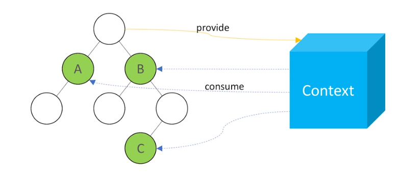

# 2022.02.06-2

---

- [1. Context API를 사용한 전역 상태 관리 흐름](#1-context-api를-사용한-전역-상태-관리-흐름)
- [2. Context API 사용법](#2-context-api-사용법)
  - [a. 새 Context 만들기](#a-새-context-만들기)
  - [b. Consumer](#b-consumer)
  - [c. Provider](#c-provider)
- [3. 동적 Context 사용법](#3-동적-context-사용법)
- [4. Consumer 대신 useContext 사용하기](#4-consumer-대신-usecontext-사용하기)

---

## Context API

### 1. Context API를 사용한 전역 상태 관리 흐름

- 프로젝트 내에서 환경설정, 사용자 정보와 같은 전역적으로 필요한 상태를 관리해야 하는 경우에 사용
- 컴포넌트는 주로 tree 형태를 가지며 데이터를 props로 전달하기 때문에 유지 보수성이 낮아질 가능성이 있음


(Image taken from https://velog.io/@devjade/context-API%EB%A1%9C-%EB%A6%AC%EC%95%A1%ED%8A%B8-%EC%83%81%ED%83%9C%EA%B4%80%EB%A6%AC-%EC%9E%98-%ED%95%98%EA%B8%B0)
<br />

### 2. Context API 사용법

#### a. 새 Context 만들기

- src 디렉터리에 contexts 디렉터리를 만든 뒤 그 안에 js 파일을 만드는 것을 권장
- 새 Context를 만들 때는 `createContext` 함수를 사용
  - 파라미터에는 해당 Context의 기본 상태를 지정

```js
// contexts/color.js
import { createContext } from 'react';

const ColorContext = createContext({ color: 'black' });

export default ColorContext;
```

#### b. Consumer

- 만든 Context(위 예제에서 `ColorContext`) 안에 있는 `Consumer` 컴포넌트를 통해 사용

```js
import React from 'react';
import ColorContext from '../contexts/color';

const ColorBox = () => {
  return (
    <ColorContext.Consumer>
      {(value) => (
        <div
          style={{ width: '64px', height: '64px', background: value.color }}
        />
      )}
    </ColorContext.Consumer>
  );
};
```

#### c. Provider

- Context의 value를 변경
- Provider를 사용할 때는 반드시 `value` 값을 명시해주어야 함
- `createContext` 때의 기본값은 Provider를 사용하지 않았을 때만 사용

```js
import React from 'react';
import ColorBox from './components/ColorBox';
import ColorContext from './contexts/color';
const App = () => {
  return (
    <ColorContext.Provider value={{ color: 'red' }}>
      <div>
        <ColorBox />
      </div>
    </ColorContext.Provider>
  );
};
export default App;
```

<br/>

### 3. 동적 Context 사용법

- value에는 상태 값 뿐만 아니라 함수를 전달할 수도 있음
- 아래의 예제에서 **`ColorProvider`**, **`ColorConsumer`** 로 `ColorContext.Provider`와 `ColorContext.Consumer`를 대체하여 사용

```js
// context/color.js
import React, { createContext, useState } from 'react';

const ColorContext = createContext({
  state: { color: 'black', subcolor: 'red' },
  actions: {
    setColor: () => {},
    setSubcolor: () => {},
  },
});

// Provider로 쓰일 컴포넌트를 새로 작성
const ColorProvider = ({ children }) => {
  const [color, setColor] = useState('black');
  const [subcolor, setSubcolor] = useState('red');

  // state와 actions 객체를 따로 분리해주면 다른 컴포넌트에서 Context 값을 사용할 때 편리
  const value = {
    state: { color, subcolor },
    actions: { setColor, setSubcolor },
  };

  return (
    <ColorContext.Provider value={value}>{children}</ColorContext.Provider>
  );
};

// const ColorConsumer = ColorContext.Consumer와 같은 의미
const { Consumer: ColorConsumer } = ColorContext;

// ColorProvider, ColorConsumer로 ColorContext.Provider와 ColorContext.Consumer를 대체
export { ColorProvider, ColorConsumer };

export default ColorContext;
```

<br/>

### 4. Consumer 대신 useContext 사용하기

- Context에 있는 값을 사용할 때 **Consumer 대신하여** 값을 받아오는 방법
- 함수형 컴포넌트에서만 사용가능(Hook)

```js
import React, { useContext } from 'react';
import ColorContext from '../contexts/color';

const ColorBox = () => {
  const { state } = useContext(ColorContext);
  return (
    <div
      style={{
        width: '64px',
        height: '64px',
        background: state.color,
      }}
    />
  );
};
```
