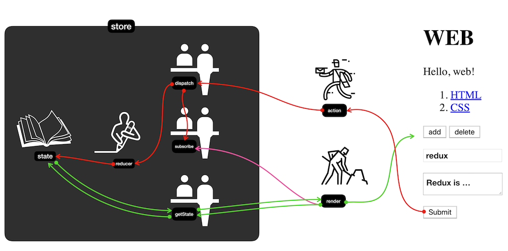

# 2022.02.07

---

- [1. 리덕스 키워드](#1-리덕스-키워드)
  - [a. 액션(action)](#a-액션action)
  - [b. 액션 생성 함수(action creator)](#b-액션-생성-함수action-creator)
  - [c. 리듀서(reducer)](#c-리듀서reducer)
  - [d. 스토어(store)](#d-스토어store)
  - [e. 디스패치(dispatch)](#e-디스패치dispatch)
  - [f. 구독(subscribe)](#f-구독subscribe)
- [2. 리덕스의 세 가지 규칙](#2-리덕스의-세-가지-규칙)
  - [a. 단일 스토어](#a-단일-스토어)
  - [b. 읽기 전용 상태](#b-읽기-전용-상태)
  - [c. 리듀서는 순수한 함수](#c-리듀서는-순수한-함수)
- [3. Redux 예시(React 없이)](#3-redux-예시react-없이)

---

## 리덕스(Redux) 라이브러리

- 컴포넌트의 상태 업데이트 관련 로직을 다른 파일로 분리시켜서 더욱 효율적으로 관리
- 리액트에 종속되는 라이브러리가 아님

### 1. 리덕스 키워드

#### a. 액션(action)

- 상태에 어떠한 변화가 필요하면 액션(action)이 발생
- 하나의 **객체**로 표현

```js
// 액션 객체 예시
{
  type: 'ADD_TODO'
  data: {
    id: 1,
    text: 'redux'
  }
}

{
  type: 'CHANGE_INPUT',
  text: 'hello'
}
```

- 액션 객체는 `type` 필드를 반드시 가지고 있어야 함(액션의 이름)
- 그 외의 값들은 나중에 상태 업데이트 시에 참고해야 할 값

#### b. 액션 생성 함수(action creator)

- 액션 객체를 만들어 주는 함수
- 변화를 일으킬 때마다 액션 객체를 생성해야하므로 이를 함수로 만들어서 관리

```js
function addTodo(data) {
  return {
    type: 'ADD_TODO',
    data,
  };
}

// 화살표 함수 사용
const changeInput = (text) => ({
  type: 'CHANGE_INPUT',
  text,
});
```

#### c. 리듀서(reducer)

- 변화를 일으키는 함수
- 액션을 만들어서 발생시키면 리듀서가 **현재 상태**와 **전달받은 액션 객체**를 파라미터로 받아옴
- 받아온 값들을 참고하여 새로운 상태를 만들어서 반환

```js
const initialState = {
  counter: 1,
};
function reducer(state = initialState, action) {
  switch (action.type) {
    case INCREMENT:
      return {
        counter: state.counter + 1,
      };
    default:
      return state;
  }
}
```

#### d. 스토어(store)

- 프로젝트에 리덕스를 적용하기 위해 만듦
- 하나의 프로젝트는 단 하나의 스토어만 보유 가능
- 스토어 안에는 **현재 애플리케이션 상태**와 **리듀서**, **내장 함수**가 들어가 있음

#### e. 디스패치(dispatch)

- 액션을 발생시키는 것
- 스토어의 내장 함수 중 하나
- 액션 객체를 파라미터로 넣어서 호출
- 호출되면 스토어는 리듀서 함수를 실행시켜서 새로운 상태를 생성

#### f. 구독(subscribe)

- 스토어의 내장 함수 중 하나
- `subscribe` 함수 안에 리스너 함수를 파라미터로 넣어서 호출해주면, 이 리스너 함수가 액션이 디스패치되어 상태가 업데이트될 때마다 호출됨

<br/>


_Image taken from https://opentutorials.org/module/4078/24935_

<br />

### 2. 리덕스의 세 가지 규칙

#### a. 단일 스토어

- 하나의 애플리케이션 안에는 하나의 스토어만 있어야 함

#### b. 읽기 전용 상태

- 리덕스 상태는 읽기 전용
- 상태를 업데이트할 때에는 기존의 객체는 건드리지 않고 새로운 객체를 생성해주어야 함(불변성 유지)
- 내부적으로 데이터가 변경되는 것을 감지하기 위해 얕은 비교(shallow equality) 검사를 하기 때문

#### c. 리듀서는 순수한 함수

- 변화를 일으키는 라듀서 함수는 순수한 함수여야 함
  - 리듀서 함수는 이전 상태와 액션 객체를 파라미터로 받음
  - 파라미터 외의 값에는 의존하면 안됨
  - 이전 상태는 절대 건드리지 않고, 변화를 준 새로운 상태 객체를 만들어서 반환
  - 똑같은 파라미터로 호출된 리듀서 함수는 언제나 똑같은 결과 값을 반환
- 비동기 작업(ex. 네트워크 요청)은 주로 미들웨어를 통해 관리
  <br />

### 3. Redux 예시(React 없이)

- 원을 누르면 색상이 toggle / `+1`, `-1` 버튼을 누르면 해당 동작을 반영하는 예시

```js
import { createStore } from 'redux';

const divToggle = document.querySelector('.toggle');
const counter = document.querySelector('h1');
const btnIncrease = document.querySelector('#increase');
const btnDecrease = document.querySelector('#decrease');

// 액션 이름 정의
const TOGGLE_SWITCH = 'TOGGLE_SWITCH';
const INCREASE = 'INCREASE';
const DECREASE = 'DECREASE';

// 액션 생성 함수
const toggleSwitch = () => ({ type: TOGGLE_SWITCH });
const increase = (difference) => ({ type: INCREASE, difference });
const decrease = () => ({ type: DECREASE });

// 초기값 설정
const initialState = {
  toggle: false,
  counter: 0,
};

// 리듀서 함수 정의
// state가 undefined일 때는 initialState를 기본값으로 사용
function reducer(state = initialState, action) {
  // action.type에 따라 다른 작업을 처리
  switch (action.type) {
    case TOGGLE_SWITCH:
      return {
        ...state, // 불변성 유지
        toggle: !state.toggle,
      };
    case INCREASE:
      return {
        ...state,
        counter: state.counter + action.difference,
      };
    case DECREASE:
      return {
        ...state,
        counter: state.counter - 1,
      };
    default:
      return state;
  }
}

// 스토어 생성
const store = createStore(reducer);

//render 함수 정의(상태가 업데이트될 때마다 호출, 이미 html을 사용해 만들어진 UI 속성을 상태에 따라 변경)
const render = () => {
  const state = store.getState(); // 현재 상태를 불러옴
  // toggle 처리
  if (state.toggle) {
    divToggle.classList.add('active');
  } else {
    divToggle.classList.remove('active');
  }
  // 카운터 처리
  counter.innerText = state.counter;
};

render();

// 구독하기(react에서는 react-redux 라이브러리가 대신 해줌)
store.subscribe(render);

// 액션 발생시키기
divToggle.onclick = () => {
  store.dispatch(toggleSwitch());
};
btnIncrease.onclick = () => {
  store.dispatch(increase(1));
};
btnDecrease.onclick = () => {
  store.dispatch(decrease());
};
```
