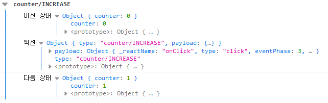
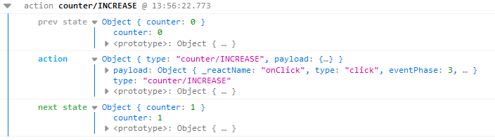

# 2022.02.09

---

- [1. 미들웨어(Middleware)](#1-미들웨어middleware)
  - [a. 미들웨어 만들기](#a-미들웨어-만들기)
  - [b. redux-logger 사용하기](#b-redux-logger-사용하기)
- [2. 비동기 작업을 처리하는 미들웨어 사용](#2-비동기-작업을-처리하는-미들웨어-사용)
  - [2-1. redux-thunk](#2-1-redux-thunk)
    - [a. thunk란?](#a-thunk란)
    - [b. 미들웨어 적용하기](#b-미들웨어-적용하기)
    - [c. Thunk 생성 함수 만들기](#c-thunk-생성-함수-만들기)
  - [2-2. redux-saga](#2-2-redux-saga)

---

## 리덕스 미들웨어를 통한 비동기 작업 관리

### 1. 미들웨어(Middleware)

- 액션과 리듀서 사이의 중간자
- **리덕스 미들웨어**는 액션을 디스패치했을 때 리듀서에서 이를 처리하기에 앞서 사전에 지정된 작업들을 실행
- 액션 → **미들웨어** → 리듀서 → 스토어
- 단순히 액션을 콘솔에 기록하거나, 전달받은 액션정보를 기반으로 액션을 아예 취소하거나 다른 종류의 액션을 추가로 디스패치할 수 있음

#### a. 미들웨어 만들기

- 일반적으로 미들웨어를 직접 만들어서 사용하지는 않음

```js
// lib/loggerMiddleware.js
const loggerMiddleware = (store) => (next) => (action) => {
  // 미들웨어 기본 구조
};

export default loggerMiddleware;
```

위 코드를 풀어서 쓰면,

```js
const loggerMiddleware = function loggerMiddleware(store) {
  return function (next) {
    return function (action) {
      // 미들웨어 기본 구조
    };
  };
};
```

- 미들웨어는 함수를 반환하는 함수를 반환하는 함수
- `next(action)`을 호출하면 다음으로 처리해야 할 미들웨어에게 액션을 넘겨주고, 다음 미들웨어가 없으면 리듀서에게 액션을 전달함


_Image taken from https://redux-advanced.vlpt.us/1/02.html_

- 미들웨어 내부에서 `store.dispatch`를 사용하면 첫 번째 미들웨어부터 다시 처리
- 미들웨어에서 `next`를 사용하지 않으면 액션이 리듀서에 전달되지 않음

```js
// lib/loggerMiddleware.js
const loggerMiddleware = (store) => (next) => (action) => {
  console.group(action && action.type);
  console.log('이전 상태', store.getState());
  console.log('액션', action);
  next(action);
  console.log('다음 상태', store.getState());
  console.groupEnd();
};

export default loggerMiddleware;
```

```js
// index.js
...
import loggerMiddleware from './lib/loggerMiddleware';

const store = createStore(rootReducer, applyMiddleware(loggerMiddleware));
...
```



#### b. redux-logger 사용하기

- `yarn add redux-logger`로 설치
- prevState, action, nextState를 콘솔에 출력해주는 오픈소스 라이브러리

```js
// index.js
...
import { createLogger } from "redux-logger";

const logger = createLogger();
const store = createStore(rootReducer, applyMiddleware(logger));
...
```



<br />

### 2. 비동기 작업을 처리하는 미들웨어 사용

### 2-1. redux-thunk

#### a. thunk란?

- 특정 작업을 나중에 할 수 있도록 미루기 위해 함수 형태로 감싼 것

ex) 주어진 파라미터에 1을 더하는 함수

```js
const addOne = (x) => x + 1;
addOne(1);
```

위의 경우, `addOne`을 호출했을 때 바로 1+1이 연산됨

```js
const addOne = (x) => x + 1;
function addOneThunk(x) {
  const thunk = () => addOne(x);
  return thunk;
}

const fn = addOneThunk(1);
setTimeout(() => {
  const value = fn();
  console.log(value);
}, 1000);
```

반면 위의 경우, 연산을 나중으로 미룸 <br/>

- redux-thunk 라이브러리를 사용하면 thunk 함수를 만들어서 디스패치 할 수 있음
- 그러면, 리덕스 미들웨어가 그 함수를 전달받아 store의 dispatch와 getState를 파라미터로 넣어서 호출

#### b. 미들웨어 적용하기

- `yarn add redux-thunk`로 라이브러리 설치

```js
// index.js
...
import ReduxThunk from "redux-thunk";

const logger = createLogger();
const store = createStore(rootReducer, applyMiddleware(logger, ReduxThunk));
...
```

#### c. Thunk 생성 함수 만들기

- redux-thunk는 액션 생성 함수에서 일반 액션 객체를 반환하는 대신 **함수를 반환**

```js
export const increaseAsync = () => (dispatch) => {
  setTimeout(() => {
    dispatch(increase());
  }, 1000);
};

export const decreaseAsync = () => (dispatch) => {
  setTimeout(() => {
    dispatch(decrease());
  }, 1000);
};
```

### 2-2. redux-saga

- 다음과 같은 좀 더 까다로운 상황에서 유용
  - 기존 요청을 취소 처리해야 할 때(불필요한 중복 요청 방지)
  - 특정 액션이 발생했을 때 다른 액션을 발생시키거나, API 요청 등 리덕스와 관계없는 코드를 실행할 때
  - 웹소켓을 사용할 때
  - API 요청 실패 시 재요청해야할 때 <br />
  - 
#### 1. Generator
- 중단점이 있는 함수(@ `yield`)

**예시)**
```js
const gen = function* () {
  console.log(1);
  yield;
  console.log(2);
  yield;
  console.log(3)
  yield 4;
}
```
```js
const generator = gen();

generator.next() // 1 출력
generator.next() // 2 출력
generator.next() // 3 출력, 4 return
generator.next() // return undefined, done: true
```

- 절대 멈추지 않는 generator
  - eventListener처럼 사용 가능

  ```js
  let i = 0;
  const gen = function*() {
    while(true) {
      yield  i++;
    }
  }
  const g = gen();
  -----
  g.next(); -> return value: 1
  g.next(); -> return value: 2
  g.next(); -> return value: 3
  ...
  ```

<br />

#### 2. Saga effects
#### 2-1. all, take, fork, call, put
- `all`: 여러 saga들을 합쳐주는 역할을 하며, 배열을 받음
- `take`: 해당 action이 dispatch 되면 generator를 next함
- `fork`: 함수를 실행(비동기 함수를 호출), 두번째 인자부터는 매개변수로 사용
- `call`: 동기 함수를 호출, 두번째 인자부터는 매개변수로 사용
- `put`: 특정 action을 dispatch 시켜주며, 파라미터로는 action 객체가 들어감
```js
function logInAPI(data) {
  return axios.post("/api/login", data);
}

function* logIn(action) {
  try {
    const result = yield call(logInAPI, action.data); 
    // fork와 call의 두 번째 인자부터는 매개변수 = loginAPI(action.data)
    // action.type에는 로그인 request가, action.data에는 로그인 data가 들어있음
    yield put({
      type: "LOG_IN_SUCCESS",
      data: result.data,
    });
  } catch (err) {
    yield put({
      type: "LOG_IN_FAILURE",
      data: err.response.data,
    });
  }
}

function* watchLogIn() {
  yield take("LOG_IN_REQUEST", logIn);
}

function* watchLogOut() {
  yield take("LOG_OUT_REQUEST", logOut);
}

function* watchAddPost() {
  yield take("ADD_POST_REQUEST", addPost);
}

// generator
export default function* rootSaga() {
  yield all([
    fork(watchLogIn),
    fork(watchLogOut),
    fork(watchAddPost),
  ]);
}
```
<br />

#### 2-2. call과 fork의 차이
- `call`: 동기 함수를 호출(blocking)
- `fork`: 비동기 함수를 호출(non-blocking)

위(1) 코드의 login generator 가장 윗 줄의 코드를
```js
const result = yield call(logInAPI, action.data); 
```
처럼 `call`을 사용할 경우, `loginAPI`가 return할 때까지 기다려서 결과를 result에 넣어줌

<br />

반면, 다음과 같이 `fork`를 사용하여 작성할 경우,
```js
const result = yield fork(logInAPI, action.data); 
```
요청을 보낸 다음, 결과가 돌아오는 것과 상관 없이 바로 다음 코드가 실행됨(non-blocking) <br />
따라서 위(1)의 코드에서는 `call`을 사용해야 함

**참고)** saga의 effect들 앞에 `yield` 키워드를 붙여주는 이유 중 하나는, 한 줄씩 실행하며 테스트가 가능하기 때문에 테스트 코드를 이용하여 테스트 시에 편리함

<br />

#### 2-3. takeEvery, takeLatest, throttle
다음과 같이 `take`를 사용하여 작성할 경우,
```js
function* watchLogIn() {
  yield take("LOG_IN_REQUEST", logIn);
}
```
action을 캐치하여 함수를 실행시키지만, 한 번 실행된 후에는 실행할 수 없음(일회성) <br />
즉, 한 번 로그인 한 후에는 다시 로그인 요청을 보낼 수 없음

<br />

따라서 while문을 이용하여 다음과 같이 무한히 실행하도록 해야하는데,
```js
function* watchLogIn() {
  while(true) {
    yield take("LOG_IN_REQUEST", logIn);
  }
}
```
이를 **`takeEvery`** 를 사용하여 작성하면 다음과 같음
```js
function* watchLogIn() {
    yield takeEvery("LOG_IN_REQUEST", logIn);
}
```

<br />

만약 로그인 버튼이 여러 번 눌렸을 떄, 가장 마지막 요청만 dispatch 하고 싶다면 다음과 같이 **`takeLatest`** 를 사용
  - 완료된 요청은 놔두고, 동시에 로딩 중인 요청들에 대해서만 마지막 요청을 제외한 요청을 취소
  - 서버로의 요청을 취소하는 것이 아닌, 서버로부터 오는 응답을 취소하는 것임
  - 즉, 서버에는 데이터가 여러 개 저장될 수 있으므로 서버 쪽에서 반드시 같은 데이터가 여러 번 저장된 것이 아닌지 확인이 필요함

```js
function* watchLogIn() {
    yield takeLatest("LOG_IN_REQUEST", logIn);
}
```

<br />

**`takeLatest`** 가 잘못된 중복 클릭에 대한 요청이 아닌 응답을 취소하는 것과는 다르게 **`throttle`** 을 사용하면 요청에 제한을 둠(DOS 공격 방지 가능)
```js
function* watchLogIn() {
    yield throttle("LOG_IN_REQUEST", logIn, 10000);
}
```

<br />

서버를 만들기 전, **`delay`** 를 사용하여 서버 요청에 대한 비동기적인 효과를 줄 수 있음
```js
yield delay(1000);
```

<br />

#### 2-4. 디바운싱과 쓰로틀링
- **디바운싱(debouncing)** : 연속으로 호출되는 함수들 중에 마지막(또는 처음)에 호출되는 함수만 실행되도록 하는 것 <br />
  ex) 브라우저의 resize 이벤트는 브라우저의 크기를 변경하는 중에 계속해서 발생 -> 그때마다 내부 로직이 실행되면 성능 상의 문제 발생 -> 디바운싱 <br />
  ex) 검색 창 <br />
- **쓰로틀링(throttling)** : 마지막 함수가 호출된 후 일정 시간이 지나기 전에 다시 호출되지 않도록 하는 것 <br />
  ex) 스크롤링 <br />
