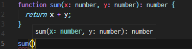
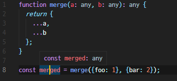
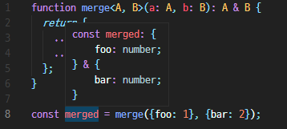
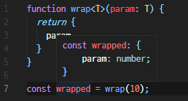

# 2022.02.14

---

- [0. Typescript를 써야하는 이유](#0-typescript를-써야하는-이유)
- [1. 환경 준비](#1-환경-준비)
  - [a. 타입스크립트 설정파일 생성](#a-타입스크립트-설정파일-생성)
  - [b. 타입스크립트 파일 만들기](#b-타입스크립트-파일-만들기)
- [2. 기본 타입](#2-기본-타입)
- [3. 함수에서의 타입 정의](#3-함수에서의-타입-정의)
- [4. interface 사용하기](#4-interface-사용하기)
  - [a. 클래스에서 interface를 implements 하기](#a-클래스에서-interface를-implements-하기)
- [5. 일반 객체를 interface로 타입 설정하기](#5-일반-객체를-interface로-타입-설정하기)
- [6. Type Alias 사용하기](#6-type-alias-사용하기)
- [7. Generics](#7-generics)
  - [a. 함수에서 Generics 사용하기](#a-함수에서-generics-사용하기)
  - [b. interface에서 Generics 사용하기](#b-interface에서-generics-사용하기)
  - [c. Type Alias에서 Generics 사용하기](#c-type-alias에서-generics-사용하기)
  - [d. 클래스에서 Generics 사용하기](#d-클래스에서-generics-사용하기)

---

[Typescript 공식 문서](https://www.typescriptlang.org/docs/handbook/2/everyday-types.html)

## Typescript 기초

### 0. Typescript를 써야하는 이유

- IDE를 적극적으로 활용하는 것이 가능
  - 자동완성 및 타입 checking으로 개발 생산성 향상
  - 컴포넌트나 함수를 사용할 때 해당 파일을 직접 열어보지 않고도 어떤 props, 매개변수를 넣어줘야 하는지 알 수 있음
  - Redux 사용시에 reducer 관련 코드를 열지 않고도 상태 객체가 어떤 구조인지 확인 가능
- 코드 작성시, 실수를 최소화
- 협업할 때 유용

### 1. 환경 준비

#### a. 타입스크립트 설정파일 생성

**<글로벌로 설치한 경우>**

다음과 같이 `tsconfig.json` 파일을 생성 후 직접 작성

```js
// tsconfig.json
{
  "compilerOptions": {
    "target": "es5",
    "module": "commonjs",
    "strict": true,
    "esModuleInterop": true
  }
}
```

**_또는_**

```js
$ yarn global add typescript  // 또는 npm install -g typescript
```

후 다음 명령어를 입력하면 `tsconfig.json` 파일이 자동으로 생성

기본적으로 만들어진 설정에서 `outDir` 속성 추가(컴파일된 파일들이 저장되는 경로를 지정)

```js
{
  "compilerOptions": {
    ...
    "outDir": "./dist" // 컴파일된 파일들이 저장되는 경로를 지정
  }
}
```

**<프로젝트 내에 설치한 typescript 패키지를 사용할 경우>**
아래의 명령어를 사용하여 typescript를 로컬 패키지로 설치한 후,

```js
$ yarn add typescript // 또는 npm install --save typescript
```

package.json 파일을 열어서 다음과 같이 `build` 스크립트 생성하고

```js
// package.json
{
  "name": "ts-practice",
  "version": "1.0.0",
  "main": "index.js",
  "license": "MIT",
  "dependencies": {
    "ts-node": "^8.4.1",
    "typescript": "^3.6.3"
  },
  "scripts": {
    "build": "tsc"
  }
}
```

빌드할 때 `yarn build` 또는 `npm run build`를 사용하여 빌드

#### b. 타입스크립트 파일 만들기

- `*.ts` 확장자 이용

```js
// src/practice.ts
const message: string = 'hello world';
console.log(message);
```

- `: string`은 해당 상수 값이 문자열이라는 것을 명시
- 만약 해당 값을 숫자로 설정하면 에디터 상에서 오류 출력

**<글로벌로 설치한 경우>**

- 코드 작성 후 `tsc` 명령어를 입력하면 `dist/practice.js` 경로에 다음과 같은 파일이 생성

```js
// dist/practice.js
'use strict';
const message = 'hello world';
console.log(message);
```

- 위와 같이, ts 파일에서 명시한 값의 타입은 컴파일 되는 과정에서 모두 사라짐

<br />

### 2. 기본 타입

```js
let count = 0; // 숫자
count += 1;
count = 'character'; // error

const message: string = 'hello world';

const done: boolean = true;

const numbers: number[] = [1, 2, 3]; // 숫자 배열
const messages: string[] = ['hello', 'world']; // 문자열 배열

messages.push(1); // 문자열 배열에 숫자 입력 불가->error

let mightBeUndefined: string | undefined = undefined; // string 또는 undefined
let nullableNumber: number | null = null; // number 또는 null

let color: 'red' | 'orange' | 'yellow' = 'red'; // red, orange, yellow 중 하나
color = 'yellow';
color = 'green'; // error
```

<br/>

### 3. 함수에서의 타입 정의

```js
function sum(x: number, y: number): number {
  return x + y;
}
```



- 위 예시처럼 매개변수와 리턴값의 타입을 정의해두면, `sum` 함수를 작성하는 과정에서 함수의 파라미터로 어떤 타입을 넣어야 하는지와 해당 함수의 리턴값의 타입을 알 수 있음
  <br/>

```js
function sumArray(numbers: number[]): number {
  return numbers.reduce((acc, current) => acc + current, 0);
}

const total = sumArray([1, 2, 3, 4, 5]);
```

- 위와 같이 배열의 내장함수(여기서는 `reduce`)를 사용할 때도 타입 유추가 잘 이루어짐
  <br/>

```js
function NoReturn(): void {
  console.log('no return');
}
```

- 만약 함수에서 아무것도 반환하지 않아야할 경우 반환 타입을 `void`로 설정

<br/>

### 4. interface 사용하기

- `interface`는 클래스 또는 객체를 위한 타입을 지정할 때 사용되는 문법

#### a. 클래스에서 interface를 implements 하기

- 클래스를 만들 때, `interface`를 사용하여 클래스가 가지고 있어야 할 요구사항을 설정
- 클래스를 선언할 때, `implements`를 사용하여 해당 클래스가 특정 `interface`의 요구사항을 구현한다는 것을 명시

```js
// Shape interface 선언
interface Shape {
  getArea(): number; // getArea라는 함수가 있어야 하며, 해당 함수의 반환값은 숫자임을 명시
}

class Circle implements Shape {
  // implements 키워드를 사용하여 해당 클래스가 Shape interface 의 조건을 충족하겠다는 것을 명시

  radius: number; // 멤버 변수(숫자)
  constructor(radius: number) {
    this.radius = radius;
  }

  // 원(Circle)의 면적을 계산하여 반환하는 함수
  getArea() {
    return this.radius * this.radius * Math.PI;
  }
}

class Rectangle implements Shape {
  width: number;
  height: number;
  constructor(width: number, height: number) {
    this.width = width;
    this.height = height;
  }
  getArea() {
    return this.width * this.height;
  }
}

const shapes: Shape[] = [new Circle(5), new Rectangle(10, 5)];

shapes.forEach((shape) => {
  console.log(shape.getArea());
});
```

<br/>

- `public`, `private`와 같은 접근자(accessor)를 사용하면 생성자 전의 변수 선언(ex. width: number)를 생략할 수 있음
- `public` 접근자는 특정 값이 클래스의 코드 밖에서도 조회 가능
- `private` 접근자는 특정 값이 클래스 내부 코드에서만 조회 가능

```js
// Shape interface 선언
interface Shape {
  getArea(): number; // getArea라는 함수가 있어야 하며, 해당 함수의 반환값은 숫자임을 명시
}

class Circle implements Shape {
  // implements 키워드를 사용하여 해당 클래스가 Shape interface 의 조건을 충족하겠다는 것을 명시

  constructor(public radius: number) { // here!
    this.radius = radius;
  }

  // 원(Circle)의 면적을 계산하여 반환하는 함수
  getArea() {
    return this.radius * this.radius * Math.PI;
  }
}

class Rectangle implements Shape {
  constructor(private width: number, private height: number) {
    this.width = width;
    this.height = height;
  }
  getArea() {
    return this.width * this.height;
  }
}

const circle = new Circle(5);
const rectangle = new Rectangle(10, 5);

console.log(circle.radius); // 정상 작동
console.log(rectangle.width); // width가 private이므로 error

const shapes: Shape[] = [new Circle(5), new Rectangle(10, 5)];

shapes.forEach(shape => {
  console.log(shape.getArea());
});
```

<br />

### 5. 일반 객체를 interface로 타입 설정하기

- 클래스가 아닌 일반 객체도 interface를 사용하여 타입 지정 가능
- `interface`를 선언할 때 다른 `interface`를 `extends`하여 상속받는 것도 허용

```js
interface Person {
  name: string;
  age?: number; // 물음표(?)는 설정을 해도 되고 안해도 되는 값임을 의미
}
interface Developer extends Person {
  skills: string[];
}

const person: Person = {
  name: '홍길동',
  age: 20,
};

const expert: Developer = {
  name: '김철수',
  skills: ['javascript', 'typescript'],
};

const people: Person[] = [person, expert];
```

<br/>

### 6. Type Alias 사용하기

- `type`은 특정 타입에 별칭(alias)을 붙이는 용도로 사용
- 객체, 배열 등 그 어떤 타입에도 별칭 붙이는 것이 가능

```ts
type Person = {
  name: string;
  age?: number;
};

// &는 Intersection으로 2개 이상의 type을 합침
type Developer = Person & {
  skills: string[];
};

const person: Person = {
  name: '홍길동',
  // age: '20'
};

const expert: Developer = {
  name: '김철수',
  skills: ['javascript', 'typescript'],
};

type People = Person[];
const people: People = [person, expert];

type Color = 'red' | 'orange' | 'yellow';
const color: Color = 'red';
const colors: Color[] = ['red', 'orange'];
```

- `type`과 `interface`의 큰 차이는 없음
- 라이브러리를 작성하거나 다른 라이브러리를 위한 타입 지원 파일을 작성하게 될 때는 `interface` 사용을 권장

<br />

### 7. Generics

- 타입스크립트에서 함수, 클래스, `interface`, `type`을 사용하게 될 때 여러 종류 타입에 대해 호환을 맞춰야 하는 상황에서 사용하는 문법

#### a. 함수에서 Generics 사용하기

- 객체 A와 객체 B를 합쳐주는 `merge` 함수를 만든다고 가정
- A와 B가 어떤 타입인지 모르므로 **`any`** 타입을 사용

```ts
function merge(a: any, b: any): any {
  return {
    ...a,
    ...b,
  };
}

const merged = merge({ foo: 1 }, { bar: 2 });
```



- 위의 경우 타입 추론이 모두 깨짐. 즉, 결과가 `any`라는 것은 merged 안에 무엇이 있는지 알 수 없다는 것을 의미 → **Generics** 사용
- `< >`안에 타입의 이름을 넣어서 사용
- 제네릭에 해당하는 타입에는 무엇이든지 들어올 수 있으며 사용할 때 타입이 깨지지 않음

```ts
function merge<A, B>(a: A, b: B): A & B {
  return {
    ...a,
    ...b,
  };
}
```


<br />

**<다른 예시>**

```ts
function wrap<T>(param: T) {
  return {
    param,
  };
}

const wrapped = wrap(10);
```


<br />

#### b. interface에서 Generics 사용하기

```ts
interface Items<T> {
  list: T[];
}

const items: Items<string> = {
  list: ['a', 'b', 'c'],
};
```

<br/>

#### c. Type Alias에서 Generics 사용하기

```ts
type Items<T> = {
  list: T[];
};

const items: Items<string> = {
  list: ['a', 'b', 'c'],
};
```

<br/>

#### d. 클래스에서 Generics 사용하기

```ts
class Queue<T> {
  list: T[] = [];
  get length() {
    return this.list.length;
  }
  enqueue(item: T) {
    this.list.push(item);
  }
  dequeue() {
    return this.list.shift();
  }
}

const queue = new Queue<number>();
// Queue<string> 등으로 다양한 원소 타입으로 이루어진 Queue 생성 가능
queue.enqueue(0);
queue.enqueue(1);
queue.enqueue(2);

console.log(queue.dequeue());
console.log(queue.dequeue());
console.log(queue.dequeue());
```
