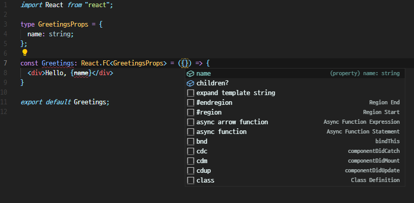
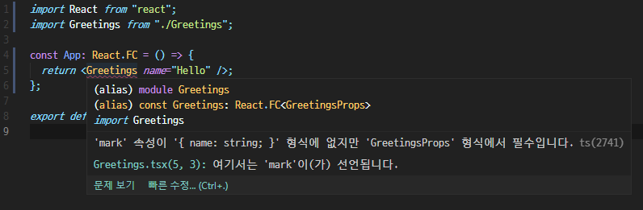

# 2022.02.15

---

- [1. 프로젝트 생성](#1-프로젝트-생성)
  - [a. 새로운 프로젝트를 생성할 경우](#a-새로운-프로젝트를-생성할-경우)
  - [b. 이미 존재하는 프로젝트에 타입스크립트를 적용할 경우](#b-이미-존재하는-프로젝트에-타입스크립트를-적용할-경우)
- [2. 새로운 컴포넌트 생성하기](#2-새로운-컴포넌트-생성하기)
  - [a. React.FC의 장점](#a-reactfc의-장점)
  - [b. React.FC의 단점](#b-reactfc의-단점)
  - [c. 컴포넌트에 생략할 수 있는 props 설정하기](#c-컴포넌트에-생략할-수-있는-props-설정하기)
  - [d. 컴포넌트에서 함수 타입의 props 받아오기](#d-컴포넌트에서-함수-타입의-props-받아오기)
  - [e. 정리](#e-정리)

---

## Typescript로 리액트 컴포넌트 작성하기

- 타입스크립트를 사용하는 리액트 컴포넌트는 `*.tsx` 확장자 사용

### 1. 프로젝트 생성

#### a. 새로운 프로젝트를 생성할 경우

```js
$ yarn create react-app my-app --template typescript
```

#### b. 이미 존재하는 프로젝트에 타입스크립트를 적용할 경우

```js
$ yarn add typescript @types/node @types/react @types/react-dom @types/jest
```

로 라이브러리 설치 후,
파일 확장자를 `js`에서 `tsx`로 변경하고 development server를 재시작

<br/>

### 2. 새로운 컴포넌트 생성하기

```ts
import React from 'react';

type GreetingsProps = {
  name: string;
};

const Greetings: React.FC<GreetingsProps> = ({ name }) => {
  <div>Hello, {name}</div>;
};

export default Greetings;
```

- `React.FC<P>` 타입은 함수형 컴포넌트(Functional Component)를 의미
- `React.FC`를 사용할 때는 props의 타입을 Generics로 넣어서 사용

#### a. React.FC의 장점

- props에 기본적으로 `children`이 들어가 있음 (`Ctrl`+`Space`로 확인 가능)
  
- 컴포넌트의 defaultProps, propTypes, contextTypes를 설정할 때 자동완성 기능을 사용할 수 있음

#### b. React.FC의 단점

- `children`이 옵셔널 형태로 들어있기 때문에 컴포넌트의 props의 타입이 명백하지 않음
  - 컴포넌트에 따라 `children`이 있어야 하는 경우도 있고 없어야 하는 경우도 있으나 이에 대한 처리를 위해서는 Props 타입 안에 `children`을 명시해야 함
  ```ts
  type GreetingsProps = {
    name: string;
    children: React.ReactNode;
  };
  ```
- `Reac.FC`를 사용하는 경우 `defaultProps`가 제대로 작동하지 않음

  ```ts
  // src/Greetings.tsx
  import React from 'react';

  type GreetingsProps = {
    name: string;
    mark: string;
  };

  const Greetings: React.FC<GreetingsProps> = ({ name, mark }) => (
    <div>
      Hello, {name} {mark}
    </div>
  );

  Greetings.defaultProps = {
    mark: '!',
  };

  export default Greetings;
  ```

  ```ts
  // src/App.tsx
  import React from 'react';
  import Greetings from './Greetings';

  const App: React.FC = () => {
    return <Greetings name="Hello" />;
  };

  export default App;
  ```

  
  <br/>

- **따라서 `React.FC`는 사용하지 않는 것이 권장되며, 이와 더불어 화살표 함수 대신 `function` 키워드를 사용하는 것을 권장**

  ```ts
  import React from 'react';

  type GreetingsProps = {
    name: string;
    mark: string;
  };

  function Greetings({ name, mark }: GreetingsProps) {
    return (
      <div>
        Hello, {name} {mark}
      </div>
    );
  }

  Greetings.defaultProps = {
    mark: '!',
  };

  export default Greetings;
  ```

#### c. 컴포넌트에 생략할 수 있는 props 설정하기

- 컴포넌트의 props 중에서 생략해도 되는 값이 있을 경우 `?` 문자를 사용

  ```ts
  import React from 'react';

  type GreetingsProps = {
    name: string;
    mark: string;
    optional?: string; // here
  };

  function Greetings({ name, mark, optional }: GreetingsProps) {
    return (
      <div>
        Hello, {name} {mark}
        {optional && <p>{optional}</p>}
      </div>
    );
  }

  Greetings.defaultProps = {
    mark: '!',
  };

  export default Greetings;
  ```

#### d. 컴포넌트에서 함수 타입의 props 받아오기

- 컴포넌트에서 특정 함수를 props로 받아와야 할 경우, 다음과 같이 타입을 지정

  ```ts
  // src/Greetings.tsx
  import React from 'react';

  type GreetingsProps = {
    name: string;
    mark: string;
    optional?: string;
    onClick: (name: string) => void; // 아무것도 리턴하지 않는다는 함수를 의미
  };

  function Greetings({ name, mark, optional, onClick }: GreetingsProps) {
    const handleClick = () => onClick(name);
    return (
      <div>
        Hello, {name} {mark}
        {optional && <p>{optional}</p>}
        <div>
          <button onClick={handleClick}>Click Me</button>
        </div>
      </div>
    );
  }

  Greetings.defaultProps = {
    mark: '!',
  };

  export default Greetings;
  ```

  ```ts
  // src/App.tsx
  import React from 'react';
  import Greetings from './Greetings';

  const App: React.FC = () => {
    const onClick = (name: string) => {
      console.log(`${name} says hello`);
    };
    return <Greetings name="Hello" onClick={onClick} />;
  };

  export default App;
  ```

#### e. 정리

- **`React.FC`는 사용하지 않는 것을 권장**
- 함수형 컴포넌트를 작성할 때는 화살표 함수 또는 `function` 키워드를 사용
- Props에 대한 타입을 선언할 때는 `interface` 또는 `type`을 사용하면 되며, **프로젝트 내부에서는 일관성을 지켜야 함**
- 컴포넌트를 사용하는 과정에서 해당 컴포넌트가 필요로 하는 props가 떠오르지 않는 경우, props를 설정하는 부분에서 **`Ctrl`+`Space`** 를 눌러 확인 가능
